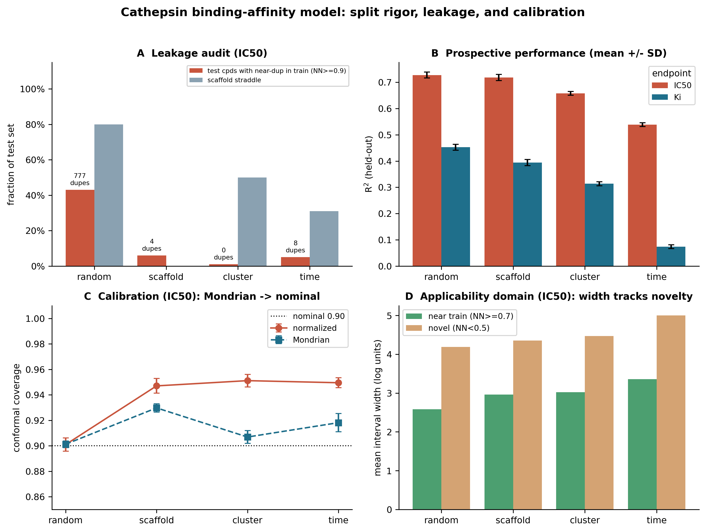

# Protein-ligand binding affinity: leakage-aware validation

A machine learning pipeline for **protein-ligand binding affinity** prediction,
built to test the question that matters in practice: *does the model actually
generalise to novel chemical space, or is it memorising near-duplicate analogues?*
The pipeline harmonises affinity data across **ChEMBL and BindingDB**, enforces
**rigorous train/test splits** (scaffold, cluster, and temporal, not naive
random), runs an explicit **data leakage audit**, and reports **calibrated
conformal uncertainty**, all with multi-seed error bars. The model is a random
forest by design (an auditable baseline) so the contribution is the *validation
rigour*, and the split/audit/conformal harness is model-agnostic.

The worked target is **cathepsin F (CTSF)** and the cathepsin family, chosen
because CTSF was nominated as a putative ageing-causal gene by an MR-anchored
multi-omic model (companion work). This is a rigour-first **methodological work
sample**: it reports an honest negative on CTSF-specific tractability rather than
overclaiming a hit (see *Honest scope*, below).



**Figure.** (A) Naive random splitting leaks heavily — hundreds of exact duplicates, ~half the test set with near-twins in train; grouped splits remove it. (B) Held-out R² falls from random → scaffold → cluster → time on both endpoints. (C) Global normalised conformal over-covers as splits harden; Mondrian difficulty-binned conformal restores near-nominal 0.90 coverage. (D) Interval width grows from near to novel test compounds — uncertainty tracks chemical distance.
---

## Data sources and harmonisation

Affinities are pulled from the two largest public binding databases and
**harmonised across sources**, because BindingDB re-distributes ChEMBL, so a
naive union double-counts and would inject guaranteed train/test leakage.

- **ChEMBL 37** (by UniProt accession; SQLite / API / CSV paths in `fetch_chembl.py`)
- **BindingDB** (202606 release; the all-data TSV, in `fetch_bindingdb.py`)
- **`merge_sources.py`** de-duplicates across sources by standardised InChIKey,
  median-aggregates, tracks provenance, and reports the overlap.

Harmonisation result (IC50): ChEMBL 7,427 + BindingDB 9,378 unique pairs; naive
union 16,805; **6,614 (39%) were the same compound-target pair in both sources**
and were de-duplicated; BindingDB added 2,764 genuinely new pairs -> **10,191
merged unique pairs**. Handling this overlap is the data-leakage-mitigation step.

---

## Headline results (ChEMBL 37 + BindingDB 202606, real data)

**The leakage audit is the centrepiece.** Naive random splitting leaks heavily
and reproduces across both endpoints (merged IC50, reference split):

| split | exact dupes across split | test cpds with near-twin in train (NN>=0.9) | scaffold straddle |
|---|---|---|---|
| random | 777 | 43% | 80% |
| scaffold | 4 | 6% | 0% |
| cluster | 0 | 1% | 50% |
| time | 8 | 5% | 31% |

**Prospective performance, honest and split-aware** (mean +/- SD over 10 seeds):

| split | IC50 R^2 | Ki R^2 |
|---|---|---|
| random | 0.734 +/- 0.011 | 0.459 +/- 0.029 |
| scaffold | 0.713 +/- 0.039 | 0.389 +/- 0.034 |
| cluster | 0.657 +/- 0.037 | 0.313 +/- 0.045 |
| **time (lead with this)** | **0.534 +/- 0.000** | **0.070 +/- 0.000** |

**Leakage optimism depends on dataset size.** The random-minus-scaffold gap is
+0.022 +/- 0.041 (IC50, 10k pairs — within noise) but +0.070 +/- 0.045 (Ki, 3.5k
pairs — beyond noise). The same leakage audit shows large structural overlap on
both, yet its *effect on R^2* shrinks as the dataset grows and diversifies — the
honest, reportable nuance.

**Mondrian conformal beats global normalised conformal, empirically.** Global
normalised split-conformal OVER-covers on the harder splits (0.95 vs nominal
0.90) by widening. Mondrian (difficulty-binned) conformal moves coverage back
toward nominal AND tightens intervals on every grouped split (merged IC50):

| split | normalized cov / width | Mondrian cov / width |
|---|---|---|
| scaffold | 0.95 / 3.27 | 0.93 / 3.07 |
| cluster | 0.95 / 3.60 | 0.91 / 3.20 |
| time | 0.95 / 4.12 | 0.92 / 3.49 |

The pipeline reports both and recommends Mondrian only when it empirically wins
on the data at hand (it does here, on both endpoints).

**CTSF: an honest negative, confirmed across two databases.** After removing
pan-cathepsin compounds shared with the training family by standardised InChIKey,
**zero** chemically distinct CTSF ligands remain (33/33 IC50, 2/2 Ki are exact
duplicates of family compounds) — in ChEMBL *and* BindingDB combined. The model
demonstrates cathepsin **pocket-class** tractability; it cannot make a
CTSF-specific generalisation claim, and — because the data are inhibitors whereas
the genetic hypothesis is CTSF *activation* — it is not ageing validation.

---

## Repository layout

| file | role | RDKit/data needed |
|---|---|---|
| `affinity_rigor.py` | engine: similarity, splits, leakage audit, RF + normalised & Mondrian conformal. `--synthetic` self-test runs with no deps | no |
| `fetch_chembl.py` | ChEMBL data layer (API / SQLite / CSV), RDKit standardise, featurise | yes |
| `fetch_bindingdb.py` | BindingDB data layer: chunked TSV parse, same standardisation | yes |
| `merge_sources.py` | cross-source harmonisation: InChIKey dedup across ChEMBL+BindingDB, overlap report | no |
| `run_pipeline.py` | multi-seed run over 4 splits, leakage-safe LOGO, dual conformal, writes reports + CSVs | yes (RDKit for physchem) |
| `make_figures.py` | the 4-panel figure (`--name` to control output filename) | no |

---

## Reproduce

```bash
pip install -r requirements.txt

# 1) ChEMBL (by UniProt accession; SQLite path shown)
python fetch_chembl.py --from-sqlite /path/chembl_37.db --endpoint IC50 --out cathepsins_IC50.parquet
python fetch_chembl.py --from-sqlite /path/chembl_37.db --endpoint Ki   --out cathepsins_Ki.parquet

# 2) BindingDB (BindingDB_All TSV from https://www.bindingdb.org/ -> Download)
python fetch_bindingdb.py --tsv BindingDB_All.tsv --endpoint IC50 --out bindingdb_IC50.parquet
python fetch_bindingdb.py --tsv BindingDB_All.tsv --endpoint Ki   --out bindingdb_Ki.parquet

# 3) harmonise across sources (InChIKey dedup; prints the overlap report)
python merge_sources.py --inputs cathepsins_IC50.parquet bindingdb_IC50.parquet --out merged_IC50.parquet
python merge_sources.py --inputs cathepsins_Ki.parquet   bindingdb_Ki.parquet   --out merged_Ki.parquet

# 4) rigor analysis (4 splits x 10 seeds, leakage audit, dual conformal, LOGO-CTSF)
python run_pipeline.py --data merged_IC50.parquet --fp merged_IC50_fp.npz --seeds 10
python run_pipeline.py --data merged_Ki.parquet   --fp merged_Ki_fp.npz   --seeds 10

# 5) figure
python make_figures.py --name rigor_figure

# engine self-test (no network, no RDKit):
python affinity_rigor.py --synthetic
```

---

## Method notes

- **Standardisation:** RDKit largest-fragment desalt -> neutralise -> InChIKey;
  replicate measurements median-aggregated per (InChIKey, gene) *before* splitting
  (measurement-leakage guard). Identical standardisation across ChEMBL and
  BindingDB so InChIKeys are comparable for cross-source dedup.
- **Features:** Morgan count fingerprints (radius 2, 2,048 bits) + 6 physicochemical
  descriptors.
- **Model:** random forest (400 trees) — an auditable baseline whose inter-tree
  dispersion also gives a per-compound difficulty estimate for conformal
  normalisation. The split/audit/conformal harness is model-agnostic.
- **Splits:** random; Bemis-Murcko scaffold; Butina cluster (Tanimoto cutoff 0.65);
  temporal (document year). 25% test, 10 seeds (temporal deterministic).
- **Conformal:** split-conformal at alpha = 0.10. Normalised (global quantile on
  |resid|/sigma) vs Mondrian (per-sigma-bin quantile). Width stratified by
  nearest-neighbour novelty as an applicability-domain diagnostic.

---

## Honest scope

This is a rigour-first methodological work sample with an explicit negative on
CTSF-specific tractability. The genetic nomination (CTSF as a putative
ageing-causal gene) **motivates** but does not license a CTSF small-molecule
programme: the public data are inhibitors, the hypothesis is activation, and CTSF
has no chemically distinct ligand series across the two largest binding databases.
The pipeline is built so these limits cannot be accidentally overstated.
